# Pattern comparison report

How vehicle age, insurance history, flood exposure, damage type and inspection outcome relate. Tags: **[REAL]** = computed from public data; **[SYNTHETIC]** = from the calibrated demo fleet (shows what the platform will surface, not evidence about Malaysian vehicles).

## Key findings

- **[REAL]** Among 25,891 US salvage lots, flood/water damage is 1.8% of lots for 0-3-year-old vehicles vs 1.5% for 16+; mechanical rises from 2.1% to 5.0% and normal wear from 0.9% to 3.1%.
- **[REAL]** Median salvage repair estimate, flood vs other damage, by age band (USD): 0-3: 16,122 vs 18,380; 4-6: 14,188 vs 14,012; 7-10: 10,037 vs 9,221; 11-15: 6,102 vs 5,872; 16+: 5,753 vs 3,779.
- **[REAL]** Median odometer (miles) flood vs other, by age band: 0-3: 11,678 vs 22,644; 4-6: 65,790 vs 72,136; 7-10: 87,245 vs 109,218; 11-15: 113,593 vs 142,102; 16+: 79,680 vs 163,694. Odometer marked 'Not Actual' on 15.6% of lots - the rollback signal a history check should catch.
- **[REAL]** Insurance claims (n=1,000): median vehicle claim by age band 0-3 41,740, 4-6 41,580, 7-10 41,960, 11-15 41,760, 16+ 43,180; fraud flag rate 0-3 25%, 4-6 23%, 7-10 26%, 11-15 25%, 16+ 24%. Claim size does not fall with age as fast as vehicle value, so older insured vehicles are likelier BER/rebuild candidates.
- **[REAL]** UK MOT 2024: first-attempt fail rates range 9.5% (honda-e) to 41.4% (renault-clio). Top defect groups per 100 tests: Lamps, reflectors and electrical equipment 23.5, Suspension 19.9, Brakes 14.3, Visibility 12.0.
- **[REAL]** NASA cells: SOH after last cycle B0005 71% @ cycle 168, B0006 58% @ cycle 168, B0007 76% @ cycle 168, B0018 72% @ cycle 132.
- **[REAL]** E-nose drift: median ammonia response on sensor 1 moves from 11257 (batch 1) to 4089 (batch 10) - why the proposal specifies daily zero and monthly span calibration.
- **[SYNTHETIC]** Fail rate by age (all vehicles): 0-3 10%, 4-6 13%, 7-10 21%, 11-15 32%, 16+ 47%. Flood-history vehicles fail at 25% vs 22% otherwise.
- **[SYNTHETIC]** Flood vs no-flood: corrosion score 5.7 vs 2.6; OBD codes present 44% vs 13%; EV HV isolation median 2.7 vs 39.9 MOhm.
- **[SYNTHETIC]** Odometer rollback: 34 of 50 injected rollbacks are visible as a >5,000 km drop between visits (the rest had only one visit - needs cross-source history). Engine swap: same-engine similarity median 0.98 vs swapped -0.04.
- **[SYNTHETIC]** Claims per 100 vehicles over 3 years by age band: 0-3 49, 4-6 62, 7-10 84, 11-15 90, 16+ 120.
- **[REAL]** Rust-hue pixel share (median): Corrosion 7.6%, Flood 1.3%, Car normal 0.3%, Car crushed 0.3%, Tyre defective 0.0%, Tyre perfect 0.5% - colour alone is a weak but real cue; the detector must learn texture and context.

## Charts

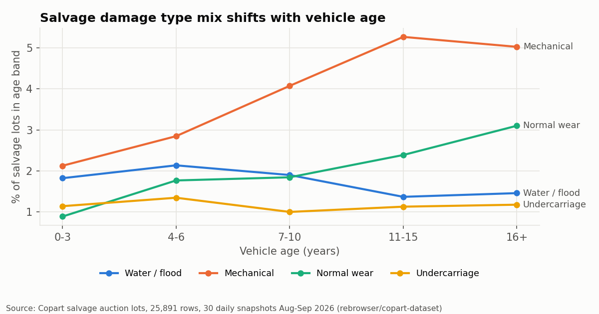
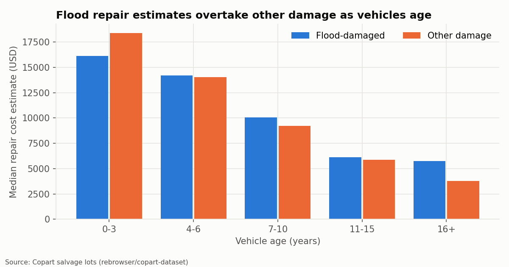
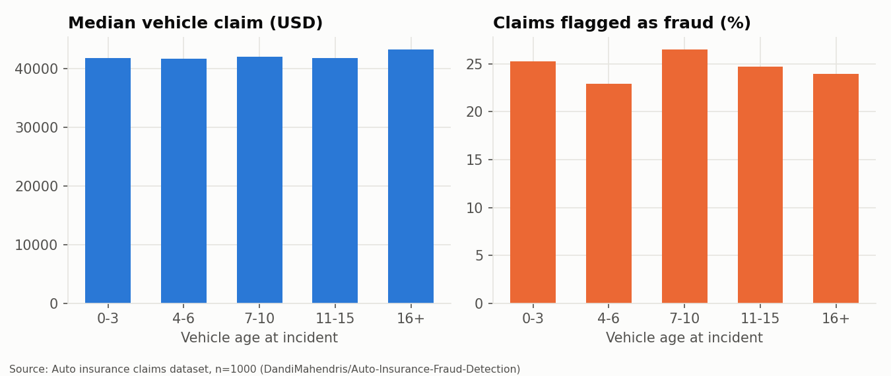
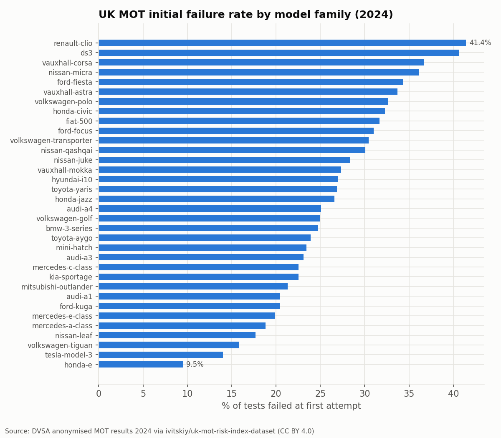
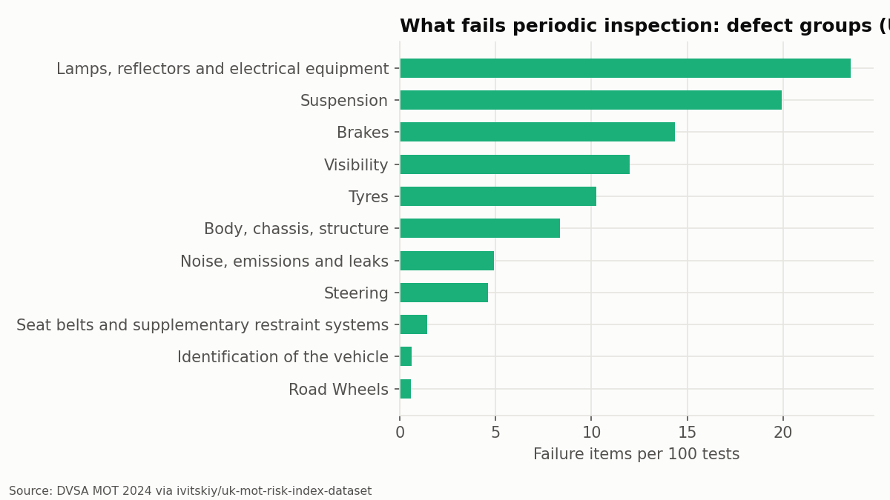
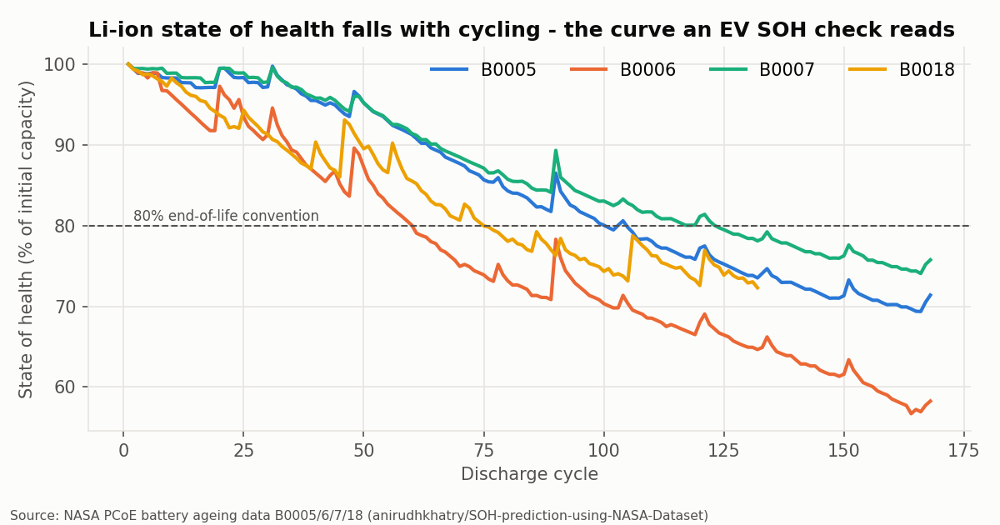
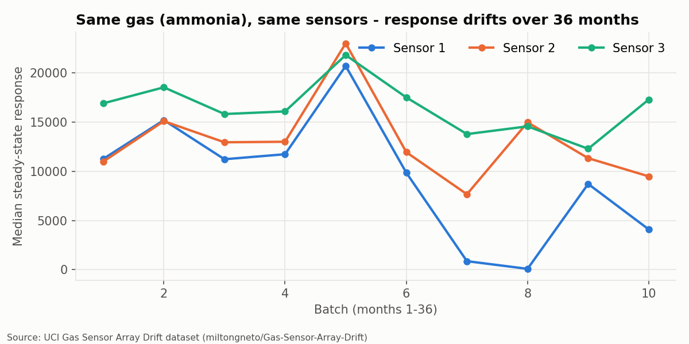
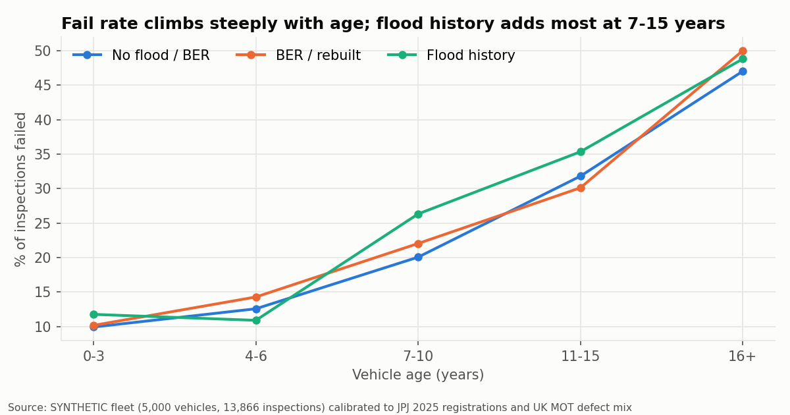
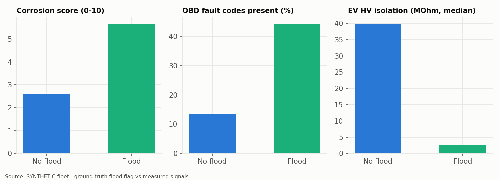
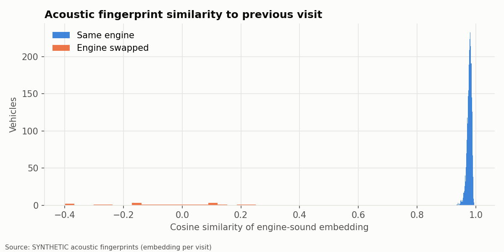
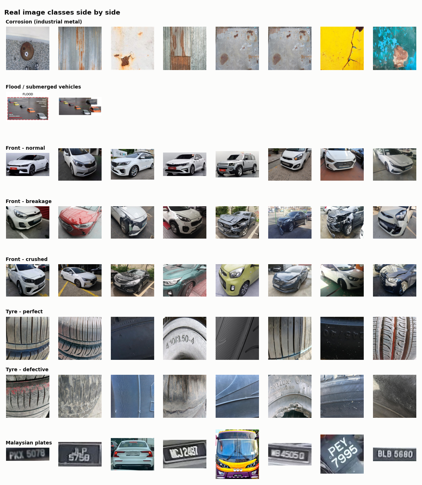
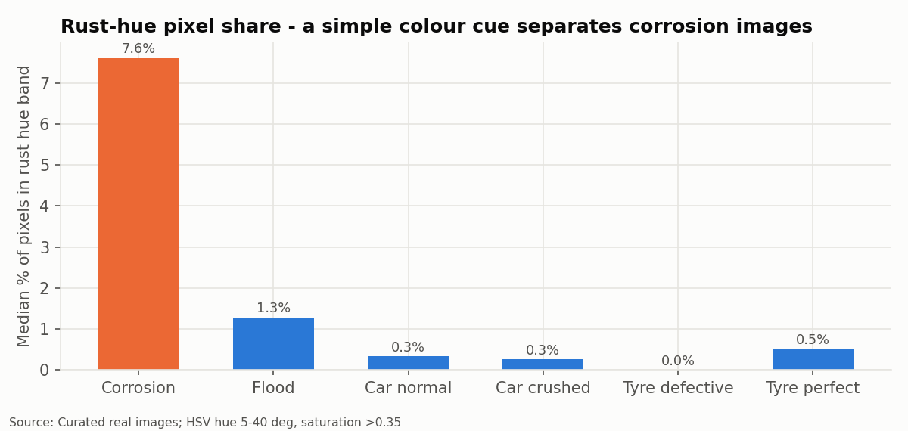

## What this means for the demo

- Age is the strongest single driver of inspection failure. The health score and next-fail risk must be age-aware, so compare each vehicle with its own make/model/age peers, as the MOT family ratios do.
- Flood history shows up across several signals at once: corrosion, electrical DTCs and EV HV isolation. That is why the fusion model, not any single sensor, flags flood (session S2).
- Older vehicles keep high claim and repair amounts while their value falls, so BER/rebuilt vehicles concentrate in older age bands. Special inspection (B2(85)) and the verified history QR matter most there.
- Odometer rollback is only visible when the history spans more than one source. This supports the digital vehicle history / QR report.
- Sensor drift is real (UCI data), so e-nose calibration is a design requirement, not an option.
