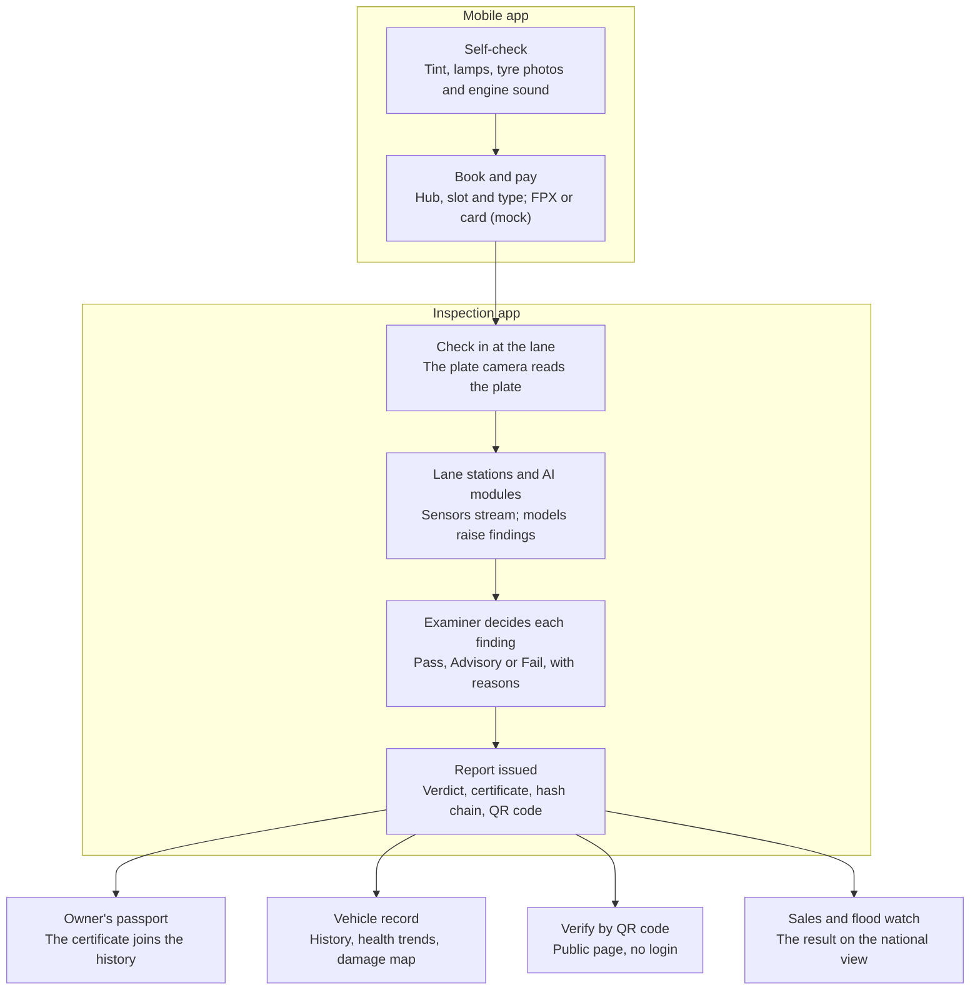
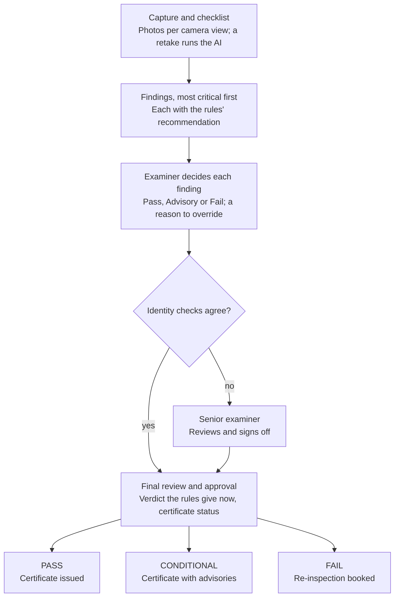

# VehicleSense Application Flow

_As of 2 October 2026, after the final demo UI and workflow pass. Based on the living doc "VehicleSense Application Flow" (Claude Docs, 1 October); its two diagrams are redrawn here as Mermaid._

## Overview

VehicleSense is one vehicle-inspection platform delivered as three apps on three addresses. All three share one backend, one hash-chained evidence log and the same ten main vehicles. The live demo runs at [spark-079e.tail1917c3.ts.net:8443](https://spark-079e.tail1917c3.ts.net:8443).

| App | Address | Who uses it | What it covers |
| --- | --- | --- | --- |
| Inspection | `/` | Examiners, hub staff, fleet managers | Dashboard, Live Lane, Inspection Management, Vehicle Records, Appointments; the floating AI assistant; Settings in the profile menu |
| Mobile | `/mobile` | Vehicle owners | Self-check, booking with mock payment, check-in ticket, health passport, selling, assistant |
| Oversight | `/oversight` | HQ operations, the regulator | HQ exceptions and lanes, registrations, used-vehicle sales, flood watch |

The inspection and mobile apps are built around ten vehicles: four lane-replay vehicles (DMO 9001 Scania truck, DMO 9002 BYD Atto 3 EV, DMO 9003 Honda Civic, DMO 9006 Perodua Myvi) and six fleet vehicles. Oversight aggregates over the full synthetic register of several thousand vehicles. Every panel carries a label saying how its data is produced (see [Data and AI pipeline](#data-and-ai-pipeline)). Old addresses such as `/hq`, `/owner` or `/fleet` redirect to their new places.

## End-to-end flow

One inspection crosses all three apps: the owner prepares and books on the phone, the hub inspects and decides, and the result is published everywhere at once.

The report is the hinge: once issued and sealed in the hash chain, the passport, the vehicle record, the public QR check and the national views all show the same result.

## Across all three apps

The same header pieces run through the inspection and oversight apps (and, where they fit, the mobile app):

- **Profile menu** (the avatar, top right): Profile and account, Settings, Demo controls (presenter only), What the data labels mean, and Sign out. Settings has the tabs Account, Apps and labels, Images, Demo (presenter and HQ) and System.
- **Floating AI assistant**: an "Ask VehicleSense AI" button in the bottom-right corner of the inspection and oversight apps. It opens a compact panel that knows what the screen shows (the vehicle, inspection, finding, lane, appointment or report) and suggests questions that fit it, so "Why was this flagged?" on a finding is answered about that finding, with the evidence it recorded. A question about the whole hub ("Summarise today at the hub") stays a hub question. "Open full assistant" carries the conversation to `/assistant`. Every answer cites the platform records it used. Pages leave room at the bottom so the button never covers their main action.
- **Guided demo** (presenter and guest viewer): the header's Guided demo button opens the nine demo scenarios. While one runs, a progress bar under the header shows the scenario, "Step X of Y", the next action, Scenarios and Exit demo, in all three apps (above the phone frame in the mobile app; on the dashboard as its own scenario card). See [The nine guided use cases](#the-nine-guided-use-cases).
- **App switcher and notifications** sit beside the profile menu; global search is in the inspection app's header.

## The inspection app

The inspection app has five sections in its sidebar; an examiner's day moves through them top to bottom. Every screen has one main action, and loading, empty and error states say what is happening ("Loading lane data…", "Waiting for vehicle…", "No active inspections.", "No appointments for this period.").

| Section | Address | What happens there |
| --- | --- | --- |
| Dashboard | `/` | Today at the Central Inspection Hub in one look. On top, five compact counts (vehicles today, completed, in progress, in queue, issues found) and, during a guided demo, the running scenario with its vehicle and next step. In the middle, the four lane cards: photo, plate, inspection type, current station, progress, the most serious open finding and its severity, status, and one button (Open Inspection, Start the replay or Open vehicle). At the bottom, upcoming vehicles, the queue and recent activity |
| Live Lane | `/lane`, `/lane?view=vision` | The lane console as it happens: the live lane view first, then what the lane has found, then the measurements and charts. AI vision runs the three AI modules on captures and the image library: Undercarriage AI (model: Keymag AI Undercarriage Inspection), Above-carriage AI (model: ASTRA) and Tyre AI (model: AI Tyre Scan), with the Laser Tyre Inspection System shown as coming next (proof of concept: tread depth and tyre integrity) |
| Inspection Management | `/inspection` | Status tabs with counts: In Progress, Awaiting Examiner, Awaiting Senior Review, Completed, Failed / Reinspection. It opens on the most relevant one. Each row shows the vehicle, lane, "N of M findings decided" and the top finding, with one action: Continue, Review findings, Senior review or View Report. Today's schedule, issued reports and the lane replays are quieter tabs and sections |
| Vehicle Records | `/vehicles`, `/vehicles/{plate}` | The ten vehicles as cards: health, latest outcome, active risk, next inspection and Open vehicle. A vehicle opens on its summary (today, latest outcome, active risks, next appointment) with shortcuts to the latest inspection and report, booking, the owner's view and the assistant; then the overview with the damage map, inspection history, health trends with a fail-date forecast, photos, claims and bookings |
| Appointments | `/appointments` | Calendar and agenda; book, reschedule, cancel, mark paid (mock) and check in with a QR code |

The full assistant (`/assistant`) and Settings (`/settings`) are pages too, reached from the floating assistant and the profile menu.

The hub's day is a plan of the ten vehicles on four lanes, laid against the clock. The four lane-replay vehicles wait on their lanes, ready, until their replay is started from the lane card or Demo control.

## Inspection workflow in detail

An inspection moves through three screens — Capture and checklist (`/inspection/{id}`), Defect Review and Findings (`/inspection/{id}/findings`), Final Review and Approval (`/inspection/{id}/review`) — and no certificate is issued while a critical finding is undecided.

- **Capture**: a "Next step" card holds the screen's one main button: Watch the lane while it runs, Review findings once findings are open, Go to final review when all are decided, View report once issued. A link under the plate opens the vehicle record.
- **Findings**: one finding at a time, most critical first. The selected finding shows why it was flagged, the observed result, the threshold or reference, the evidence, its source and module, and a previous trend only where the vehicle's history has that measurement. A progress card reads "N of M findings decided". "Go to final review" is open at any time and says how many critical findings are still to decide; it becomes the main button once they are all decided, and the review page will not issue the report before then.
- **Final review**: a summary card with the vehicle, time, health score, outcome, key findings, examiner and report status, and one dominant Issue button. Once issued, a success panel offers View Report, Verify by QR, View Vehicle Record, Open Owner Passport, Send Report to Owner, Finish Inspection and, during a guided demo, Continue Demo. For a FAIL, Schedule Reinspection is the main button. The hash chain and data sources sit in a folded "Proof" section.

Every report is hash-chained, verifiable by its QR code and sent to the owner (mock). While critical findings are open, the review screen shows "Decision pending". A failed vehicle is booked for re-inspection straight from the review, and the booking appears in Appointments.

## Live Lane and the damage map

Two views show the examiner where a vehicle is and where its problems are.

**Live lane view** (Live Lane, with a compact strip on the dashboard, the Live lanes tab and the capture screen):

- The lane is drawn as an inspection-hall floor with its ten numbered stations, in the order a vehicle is inspected:

  | # | Station | What it checks |
  | --- | --- | --- |
  | 1 | Identification | Registration (plate camera at check-in), chassis and engine numbers, the odometer |
  | 2 | Above-carriage | Body, cabin and visible condition (Above-carriage AI) |
  | 3 | Tinted glass | Visible light transmittance of the windscreen and windows |
  | 4 | Emission | Smoke or exhaust gases against the legal limits, OBD fault codes (an EV's battery and high-voltage checks) |
  | 5 | Side slip | Alignment of the front wheels |
  | 6 | Suspension | Suspension efficiency per axle |
  | 7 | Brake | Brake efficiency and imbalance on the roller tester |
  | 8 | Undercarriage | Undercarriage condition and the tyres (Undercarriage AI, Tyre AI, the thermal camera) |
  | 9 | Speedometer | The speedometer against the true road speed on the rollers (40-48 km/h at a true 40 km/h) |
  | 10 | Headlight alignment | Headlight beam alignment |

  Then the examiner's review and the report. The inspection checklist follows the same ten stations in the same order, and the lane definition lives in one place (`app/backend/vhi/lane.py`).
- The vehicle's photo glides from station to station on the replay clock; Pause and speed (up to 4×) control it.
- The current station shows its readings counting up: brake force per wheel, particle number, OBD values, instruments, a scanning animation while the AI modules run.
- New findings slide in as pop-ups with the finding, its severity, station and module, an evidence thumbnail and Open finding; a confidence appears only when a model actually produced one. "Why was this flagged?" is answered on the finding's own page. Each station keeps a count of its findings.

**Damage map** (findings page, capture screen, each vehicle record):

- Every finding is a pin on the vehicle's photo, at the part it concerns: a wheel, the exhaust, the engine bay, the underbody, a lamp, a panel. Pins are placed from the finding's code first, then its words; the card says "approx." when the finding does not state an exact spot.
- Front, Rear and Plan switch between the two photos and a top-down plan that shows every side and the underbody.
- Colour gives severity; open high findings pulse, decided ones are hollow, under-vehicle ones are dashed.
- A pin opens a card: what was found, where, the module and its confidence, the evidence image and Open finding. On the findings page it focuses that finding directly.

## Mobile app flow

The mobile app takes an owner from "is my car ready?" to a certificate in their passport. On a desktop it shows in a phone frame with a persona switcher for the presenter; on a phone it is full screen with five tabs: Home, Vehicle, Check, Book, Assistant.

1. **Home** (`/mobile`): the vehicle card with its photo, health, next inspection due and road-tax expiry; a "Next step" card that shows the owner's journey (Self-check, Book, Check-in, Inspection, Passport, Sell) and the one thing to do now, with the booking ticket inside it once booked; the latest report; updates.
2. **Self-check** (`/mobile/check`): six guided steps:
   - **Plate:** a photo of the rear number plate; the plate reader checks it can be read and matches the registration.
   - **Tint, Lamps and Tyres:** the window tint, the headlamps, and tyre photos checked by AI.
   - **Brakes:** "Test your brakes", a short guided test the owner does in a safe place: warning light, pedal feel, straight stop, noise and handbrake, each answered yes or no and turned into advice.
   - **Engine:** a 20-second engine sound clip.

   A first run may say "Fix these first" (a muddy plate, dark tint, a lamp out); after fixing, "Ready for inspection".
3. **Book** (`/mobile/book`): pick a hub, a nearby free slot and the inspection type, then pay (FPX or card, mock). The ticket carries a QR code and a check-in code; bookings can be rescheduled or cancelled.
4. **Check-in**: at the lane the plate camera reads the plate and checks the booking in; staff can also check it in from Appointments. The public check-in page is `/checkin/{token}`.
5. **Inspection**: the vehicle runs through the lane and the examiner decides its findings in the inspection app.
6. **Passport** (`/mobile/vehicle`): the new certificate joins the history, odometer and reports; anyone can confirm a report by scanning its QR code (`/verify/{token}`, no login).
7. **Sell** (`/mobile/sell`): list the vehicle with its whole record; buyers see the red flags and can verify the latest report.

The assistant (`/mobile/assistant`) answers owners' questions in English or Malay at any step. The owner's app speaks plainly: no model names or raw confidence numbers, and data labels in everyday words ("AI-assisted", "Demo data", "Simulated in the demo"), with the formal label in the tooltip.

## Oversight app flow

Oversight is the national view: it starts on an overview with one live tile per section (each ending in its next action, such as "Review N open exceptions") and a river-level map, and each tile opens its section. Each workflow shows its steps on screen, with the current one highlighted; maps and charts support the action rather than lead. When the live feed is unavailable, the page says so and shows the latest stored snapshot.

| Section | Address | The flow |
| --- | --- | --- |
| HQ operations · Lanes | `/oversight/hq` | Steps on every exception: Open exception → Review evidence → Record action → Mark handled. Exceptions cover examiner integrity, lane equipment health and demand against lane capacity; Record action is the main button and the action is hash-chained. Also lanes and hubs on a map, the demand forecast from today, the audit chain and its tamper test |
| Regulator · Registrations | `/oversight/regulator` | Registrations from public data, inspection fail rates and top defects, high-emitter hits and roadside sites on a map |
| Used-vehicle sales | `/oversight/sales` | Search → Vehicle record → Red flags/history → Latest report → Public verification. A vehicle's whole record shows inspections, odometer, claims, fault codes, red flags and next-test risk; "Verify this report" opens the public QR page, no login |
| Flood watch | `/oversight/flood` | Select risk area/vehicle → Review reasons → Invite for inspection (mock) → View inspection result. Live river levels on a map that refreshes every 45 s; the selected vehicle's main button is Invite for inspection, then View inspection result, with links to its latest inspection and vehicle record. Past flood events can be replayed as views |

HQ opens all four sections; the regulator opens all but HQ operations.

## Data and AI pipeline

Every result travels the same path, from a lane sensor to a report anyone can verify.

1. **Lane sensors** stream readings: brake roller, particle counter, smoke, OBD, e-nose, microphones and cameras. In the demo they are replays of four recorded sessions, sent over a message bus and a WebSocket.
2. **Models** analyse them live: plate and chassis reading, Undercarriage AI (Keymag AI Undercarriage Inspection), Above-carriage AI (ASTRA) and Tyre AI (AI Tyre Scan) on the images, engine and wheel-bearing sounds, corrosion, flood risk, EV battery health, and a fused health score with next-fail risk.
3. **Rules** turn measurements and model outputs into findings, each with a severity and whether it is a fail item.
4. **The examiner** decides each finding: Pass, Advisory or Fail. Going against the rules' recommendation needs a written reason; identity conflicts go to a senior examiner.
5. **The report** is issued with its verdict and certificate, sealed in a SHA-256 hash chain, with a QR code for public verification.
6. **Downstream**: the vehicle record, the owner's passport, the fleet's health trends and oversight all show the result.

Every panel says how its content is produced, with a small grey tag and a coloured dot that never competes with a severity, an outcome or a button (crowded screens keep the detail in the tooltip):

| Label | Meaning |
| --- | --- |
| LIVE FEED | Fetched live from a public source (e.g. river levels) |
| PUBLIC DATA | A stored snapshot of public data |
| LIVE MODEL | A trained model running now |
| LIVE LOGIC | Rules or calculations running now |
| SIMULATED | Replayed sensor sessions |
| SYNTHETIC | Generated, fictional records |
| SAMPLE | Sample images with pre-drawn AI boxes, or stock photos |
| MOCK | A stand-in for an outside system (payment, messages) |
| FUTURE R&D | Shown as a preview, not yet in service |

## The nine guided use cases

The Guided demo button in the header opens the nine scenarios (Demo control at `/demo` lists them too, with the lane replays). Starting one resets only that scenario's own demo state and opens its first screen; the progress bar then shows the step, the next action and Exit demo, on whichever app the step happens.

| Use case | Vehicle | Apps it runs through | Outcome |
| --- | --- | --- | --- |
| UC-01 Commercial vehicle: emissions and brake failure | DMO 9001 Scania | Inspection | FAIL report; the vehicle record shows it |
| UC-02 EV flood-risk inspection | DMO 9002 BYD Atto 3 | Inspection, mobile passport | CONDITIONAL EV Health Certificate, recorded in the history |
| UC-03 Odometer rollback and senior review | DMO 9003 Honda Civic | Inspection, mobile passport | Referred to a senior examiner, whose decision is in the report |
| UC-04 Clean inspection, no anomalies | DMO 9006 Perodua Myvi | Inspection, mobile passport | PASS, and the health passport updates |
| UC-05 Owner self-check, booking and inspection | DMO 9006 Perodua Myvi | Mobile, inspection | The certificate appears in the owner's passport |
| UC-06 Fleet predictive maintenance | DMO 9001 Scania | Vehicle Records, inspection | Booked before its fail date, inspected, result in its record |
| UC-07 HQ exception investigation | All hubs | Oversight | Action recorded and hash-chained; the exception is handled |
| UC-08 Flood watch to inspection invitation | DMO 9002 BYD Atto 3 | Oversight, inspection | Invitation recorded (mock); flood watch shows the result |
| UC-09 Used-vehicle buyer trust and verification | DMO 9003 Honda Civic | Oversight, public verify page | "Genuine, unaltered report", without a login |

## Logins, roles and addresses

Each demo account lands in its own app; the server checks the role on every request. Passwords are shared separately, not in this file.

| Account | Role | Lands on | Can open |
| --- | --- | --- | --- |
| Demo presenter | Runs the demo | `/` | Every app and section, every action |
| Arjun Ismail | Examiner, Central Inspection Hub | `/` | The inspection app; decides findings and issues reports |
| Priya Hassan | Senior examiner | `/` | As the examiner, plus senior sign-off on referred cases |
| Operations manager | HQ | `/oversight/hq` | All of oversight and the inspection app |
| Regulator officer | Regulator | `/oversight/regulator` | Regulator, sales and flood watch; inspection reports and vehicle records |
| Fleet manager | Fleet | `/vehicles` | Vehicle Records with health trends, Appointments, the AI assistant |
| Nurul Aina | Vehicle owner (DMO 9006) | `/mobile` | The mobile app for her own vehicle |
| Guest viewer | Read only | `/` | Every app to look at; no changes |

Public pages need no login: the booking check-in page `/checkin/{token}` and report verification `/verify/{token}`.

## Links between the apps

Each result leads on to the next place it matters:

| From | To |
| --- | --- |
| An inspection (capture, review) | The vehicle record |
| A report or the final review | The owner's passport, the public QR verification, the vehicle record |
| A vehicle record | Its latest inspection and report, booking an appointment, the owner's view |
| A fleet vehicle's risk (health trends) | Booking an inspection before its fail date |
| A flood-risk vehicle | Its latest inspection and vehicle record |
| A used-vehicle listing | The vehicle record and the public verification |
