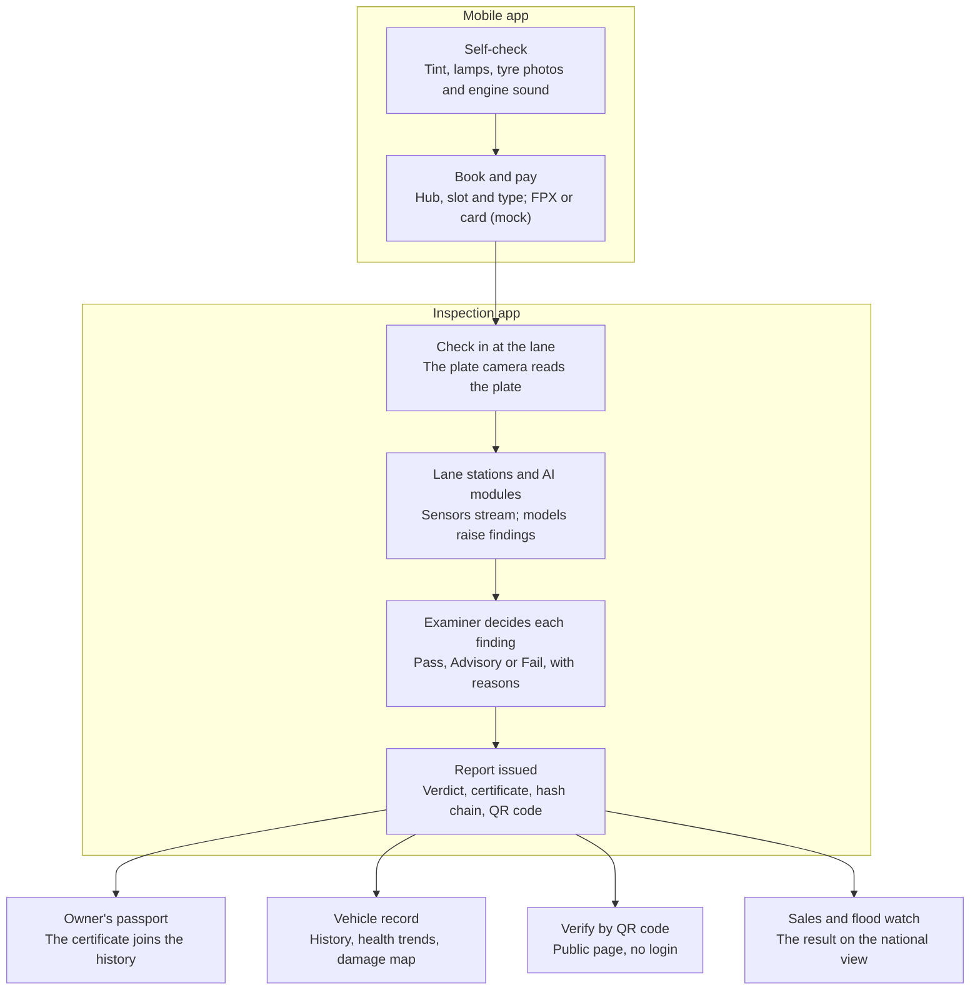
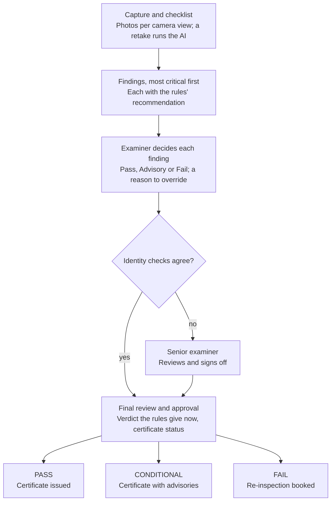

# VehicleSense Application Flow

_As of 1 October 2026. A copy of the living doc "VehicleSense Application Flow" (Claude Docs); its two diagrams are redrawn here as Mermaid._

## Overview

VehicleSense is one vehicle-inspection platform delivered as three apps on three addresses. All three share one backend, one hash-chained evidence log and the same ten main vehicles. The live demo runs at [spark-079e.tail1917c3.ts.net:8443](https://spark-079e.tail1917c3.ts.net:8443).

| App | Address | Who uses it | What it covers |
| --- | --- | --- | --- |
| Inspection | `/` | Examiners, hub staff, fleet managers | Dashboard, Live Lane, Inspection Management, Vehicle Records, Appointments, Chat Bot, Settings |
| Mobile | `/mobile` | Vehicle owners | Self-check, booking with mock payment, check-in ticket, health passport, selling, assistant |
| Oversight | `/oversight` | HQ operations, the regulator | HQ exceptions and lanes, registrations, used-vehicle sales, flood watch |

The inspection and mobile apps are built around ten vehicles: four lane-replay vehicles (DMO 9001 Scania truck, DMO 9002 BYD Atto 3 EV, DMO 9003 Honda Civic, DMO 9006 Perodua Myvi) and six fleet vehicles. Oversight aggregates over the full synthetic register of several thousand vehicles. Every panel carries a label saying how its data is produced (see [Data and AI pipeline](#data-and-ai-pipeline)). Old addresses such as `/hq`, `/owner` or `/fleet` redirect to their new places.

## End-to-end flow

One inspection crosses all three apps: the owner prepares and books on the phone, the hub inspects and decides, and the result is published everywhere at once.

The report is the hinge: once issued and sealed in the hash chain, the passport, the vehicle record, the public QR check and the national views all show the same result.

## The inspection app

The inspection app has exactly seven sections in its sidebar; an examiner's day moves through them top to bottom.

| Section | Address | What happens there |
| --- | --- | --- |
| Dashboard | `/` | Today at the Central Inspection Hub: vehicles, completed, in progress, in queue, issues found; the four lane cards with the vehicle on each and a live progress strip; lane utilization, the queue, upcoming vehicles and recent activity |
| Live Lane | `/lane`, `/lane?view=vision` | The lane console as it happens (the live lane view, sensors and charts) and AI vision: Undercarriage AI, Above-carriage AI and Tyre AI on captures and the image library |
| Inspection Management | `/inspection` | Live lanes, today's schedule and issued reports; each inspection's capture, findings and final review screens |
| Vehicle Records | `/vehicles`, `/vehicles/{plate}` | The ten vehicles with photos; per vehicle: overview with the damage map, inspection history, health trends with a fail-date forecast, photos, claims and bookings |
| Appointments | `/appointments` | Calendar and agenda; book, reschedule, cancel, mark paid (mock) and check in with a QR code |
| Chat Bot | `/assistant` | The operations assistant: answers on vehicles, lanes, findings, reports, appointments and rules, citing the platform data it used, in English or Malay |
| Settings | `/settings` | Account and apps, the image library with generation prompts and uploads, demo control and restarting the hub's day, pipeline status |

The hub's day is a plan of the ten vehicles on four lanes, laid against the clock. The four lane-replay vehicles wait on their lanes, ready, until their replay is started from the lane card or Demo control.

## Inspection workflow in detail

An inspection moves through three screens — Capture and checklist (`/inspection/{id}`), Defect Review and Findings (`/inspection/{id}/findings`), Final Review and Approval (`/inspection/{id}/review`) — and no certificate is issued while a critical finding is undecided.

Every report is hash-chained, verifiable by its QR code and sent to the owner (mock). While critical findings are open, the review screen shows "Decision pending". A failed vehicle is booked for re-inspection straight from the review, and the booking appears in Appointments.

## Live Lane and the damage map

Two views show the examiner where a vehicle is and where its problems are.

**Live lane view** (Live Lane, with a compact strip on the dashboard, the Live lanes tab and the capture screen):

- The lane is drawn as an inspection-hall floor with its stations: check-in and identity, emissions and OBD (EV battery and OBD for an EV), brakes, suspension and side slip, lamps and tint, underbody and tyre AI, body and cabin AI, then the examiner and the report.
- The vehicle's photo glides from station to station on the replay clock; Pause and speed (up to 4×) control it.
- The current station shows its readings counting up: brake force per wheel, particle number, OBD values, instruments, a scanning animation while the AI modules run.
- New findings slide in as pop-ups with severity, station, module and confidence, an evidence thumbnail and Open; each station keeps a count of its findings.

**Damage map** (findings page, capture screen, each vehicle record):

- Every finding is a pin on the vehicle's photo, at the part it concerns: a wheel, the exhaust, the engine bay, the underbody, a lamp, a panel. Pins are placed from the finding's code first, then its words; the card says "approx." when the finding does not state an exact spot.
- Front, Rear and Plan switch between the two photos and a top-down plan that shows every side and the underbody.
- Colour gives severity; open high findings pulse, decided ones are hollow, under-vehicle ones are dashed.
- A pin opens a card: what was found, where, the module and its confidence, the evidence image and Open finding. On the findings page it focuses that finding directly.

## Mobile app flow

The mobile app takes an owner from "is my car ready?" to a certificate in their passport. On a desktop it shows in a phone frame with a persona switcher for the presenter; on a phone it is full screen with five tabs: Home, Vehicle, Check, Book, Assistant.

1. **Home** (`/mobile`): the vehicle card with its photo, health, next inspection due and road-tax expiry; the active booking ticket; the latest report; updates.
2. **Self-check** (`/mobile/check`): a guided check of window tint, headlamps, tyre photos and the engine sound. A first run may say "Fix these first"; after fixing, "Ready for inspection".
3. **Book** (`/mobile/book`): pick a hub, a nearby free slot and the inspection type, then pay (FPX or card, mock). The ticket carries a QR code and a check-in code; bookings can be rescheduled or cancelled.
4. **Check-in**: at the lane the plate camera reads the plate and checks the booking in; staff can also check it in from Appointments. The public check-in page is `/checkin/{token}`.
5. **Inspection**: the vehicle runs through the lane and the examiner decides its findings in the inspection app.
6. **Passport** (`/mobile/vehicle`): the new certificate joins the history, odometer and reports; anyone can confirm a report by scanning its QR code (`/verify/{token}`, no login).
7. **Sell** (`/mobile/sell`): list the vehicle with its whole record; buyers see the red flags and can verify the latest report.

The assistant (`/mobile/assistant`) answers owners' questions in English or Malay at any step.

## Oversight app flow

Oversight is the national view: it starts on an overview with one live tile per section and a river-level map, and each tile opens its section.

| Section | Address | The flow |
| --- | --- | --- |
| HQ operations · Lanes | `/oversight/hq` | Open exceptions (examiner integrity, lane equipment health, demand against lane capacity) → drill into the evidence → record an action, which is hash-chained → the exception shows as handled. Also lanes and hubs on a map, the demand forecast from today, the audit chain and its tamper test |
| Regulator · Registrations | `/oversight/regulator` | Registrations from public data, inspection fail rates and top defects, high-emitter hits and roadside sites on a map |
| Used-vehicle sales | `/oversight/sales` | Search listings → open a vehicle's whole record (inspections, odometer, claims, fault codes, red flags, next-test risk) → review the latest report → verify it by QR without a login |
| Flood watch | `/oversight/flood` | Live river levels on a map that refreshes every 45 s → districts and vehicles at risk with their reasons → invite an owner for a flood-damage inspection (mock) → the inspection's result shows back on the vehicle. Past flood events can be replayed as views |

HQ opens all four sections; the regulator opens all but HQ operations.

## Data and AI pipeline

Every result travels the same path, from a lane sensor to a report anyone can verify.

1. **Lane sensors** stream readings: brake roller, particle counter, smoke, OBD, e-nose, microphones and cameras. In the demo they are replays of four recorded sessions, sent over a message bus and a WebSocket.
2. **Models** analyse them live: plate and chassis reading, Undercarriage AI, Above-carriage AI and Tyre AI on the images, engine and wheel-bearing sounds, corrosion, flood risk, EV battery health, and a fused health score with next-fail risk.
3. **Rules** turn measurements and model outputs into findings, each with a severity and whether it is a fail item.
4. **The examiner** decides each finding: Pass, Advisory or Fail. Going against the rules' recommendation needs a written reason; identity conflicts go to a senior examiner.
5. **The report** is issued with its verdict and certificate, sealed in a SHA-256 hash chain, with a QR code for public verification.
6. **Downstream**: the vehicle record, the owner's passport, the fleet's health trends and oversight all show the result.

Every panel says how its content is produced:

| Label | Meaning |
| --- | --- |
| LIVE FEED | Fetched live from a public source (e.g. river levels) |
| PUBLIC DATA | A stored snapshot of public data |
| LIVE MODEL | A trained model running now |
| LIVE LOGIC | Rules or calculations running now |
| SIMULATED | Replayed sensor sessions |
| SYNTHETIC | Generated, fictional records |
| SAMPLE | Sample images with pre-drawn AI boxes, or stock photos |
| MOCK | A stand-in for an outside system (payment, messages) |
| FUTURE R&D | Shown as a preview, not yet in service |

## The nine guided use cases

Demo control (`/demo`, or Settings → Demo) starts any of nine end-to-end stories; the header then shows the next step, on whichever app it happens.

| Use case | Vehicle | Apps it runs through | Outcome |
| --- | --- | --- | --- |
| UC-01 Commercial vehicle: emissions and brake failure | DMO 9001 Scania | Inspection | FAIL report; the vehicle record shows it |
| UC-02 EV flood-risk inspection | DMO 9002 BYD Atto 3 | Inspection, mobile passport | CONDITIONAL EV Health Certificate, recorded in the history |
| UC-03 Odometer rollback and senior review | DMO 9003 Honda Civic | Inspection, mobile passport | Referred to a senior examiner, whose decision is in the report |
| UC-04 Clean inspection, no anomalies | DMO 9006 Perodua Myvi | Inspection, mobile passport | PASS, and the health passport updates |
| UC-05 Owner self-check, booking and inspection | DMO 9006 Perodua Myvi | Mobile, inspection | The certificate appears in the owner's passport |
| UC-06 Fleet predictive maintenance | DMO 9001 Scania | Vehicle Records, inspection | Booked before its fail date, inspected, result in its record |
| UC-07 HQ exception investigation | All hubs | Oversight | Action recorded and hash-chained; the exception is handled |
| UC-08 Flood watch to inspection invitation | DMO 9002 BYD Atto 3 | Oversight, inspection | Invitation recorded (mock); flood watch shows the result |
| UC-09 Used-vehicle buyer trust and verification | DMO 9003 Honda Civic | Oversight, public verify page | "Genuine, unaltered report", without a login |

## Logins, roles and addresses

Each demo account lands in its own app; the server checks the role on every request. Passwords are shared separately, not in this file.

| Account | Role | Lands on | Can open |
| --- | --- | --- | --- |
| Demo presenter | Runs the demo | `/` | Every app and section, every action |
| Arjun Ismail | Examiner, Central Inspection Hub | `/` | The inspection app; decides findings and issues reports |
| Priya Hassan | Senior examiner | `/` | As the examiner, plus senior sign-off on referred cases |
| Operations manager | HQ | `/oversight/hq` | All of oversight and the inspection app |
| Regulator officer | Regulator | `/oversight/regulator` | Regulator, sales and flood watch; inspection reports and vehicle records |
| Fleet manager | Fleet | `/vehicles` | Vehicle Records with health trends, Appointments, Chat Bot |
| Nurul Aina | Vehicle owner (DMO 9006) | `/mobile` | The mobile app for her own vehicle |
| Guest viewer | Read only | `/` | Every app to look at; no changes |

Public pages need no login: the booking check-in page `/checkin/{token}` and report verification `/verify/{token}`.
